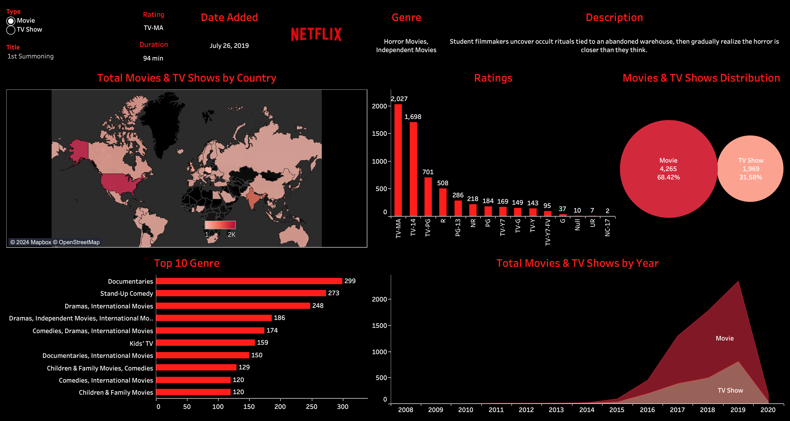

# Netflix Dashboard with Tableau
This repository contains the twb file and data files used for creating a Netflix dashboard using Tableau. The dashboard is designed to analyze and visualize various aspects of Netflix data, including the distribution of movies and TV shows, top genres, ratings, and more.

## Files Included
- **netflix_titles.csv**: The CSV file containing the Netflix data used in the tutorial.
- **Netflix.twb**: Tableau workbook file containing the dashboard and associated visualizations.

## Dashboard Overview

1. Data Import: Import the provided CSV file containing Netflix data into Tableau.
2. Data Exploration: Explore the dataset, which includes fields such as show ID, type (movie or TV show), title, director, cast, date added, release year, rating, duration, and description.
3. Creating Visualizations:
- Plot the number of movies and TV shows added to Netflix over the years.
- Create a map visualization showing the distribution of movies and TV shows by country.
- Generate a bar chart displaying the top 10 genres of movies and TV shows.
- Design a visualization to analyze ratings distribution.
4. Dashboard Creation: Combine the visualizations created above into a single dashboard for comprehensive analysis.
5. Customization: Customize the dashboard layout, colors, and formatting for better visual appeal.
6. Final Touches: Add additional features such as filters, tooltips, and images to enhance the dashboard.

## Screenshot

## Link to Dashboard
[Click Here!](https://public.tableau.com/app/profile/pooja.patel5686/viz/Netflix_17113176392510/Netflix)